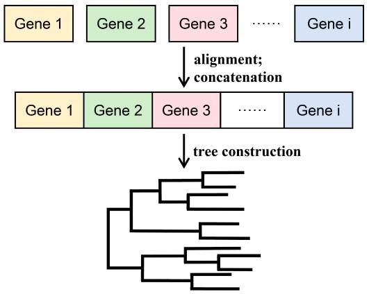
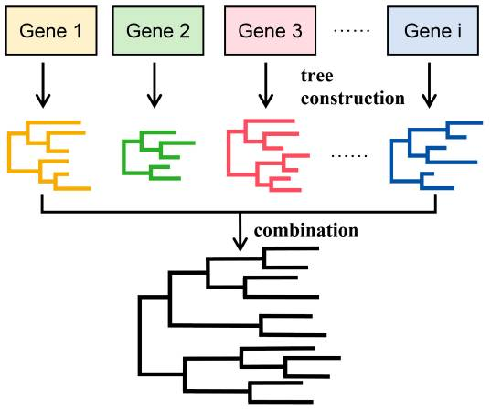
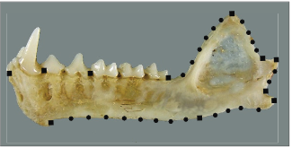

## Présentations

### Installation et présentation de R et RStudio

Dans ce TP/TD, nous allons utiliser le language de programmation R et depuis RStudio, un Environnement de Développmenet Intégré (IDE). Pour l'installation de R et Rstudio, le plus simple est encore de se rendre [directement sur le site de RStudio](https://posit.co/download/rstudio-desktop/) et de se laisser guider.

La première étape est d'installer R, ici, le site de RStudio nous redirige vers la page d'accueil du CRAN (The Comprehensive R Archive Network), une archive en ligne qui liste les différentes distributions de R dans sa version la plus récente.\
Ici, je vous laisse choisir la version qui correspond à votre système d'exploitation. Si vous avez un ancien système d'exploitation, il sera peut-être nécessaire d'installer une ancienne distribution de R.

#### Installation des packages

Revenons au CRAN, en plus de stocker différentes version de R et de les rendre disponibles au téléchargement partout dans le monde, cette archive sera aussi notre principale source de packages.\
Les packages sont des extensions à la version de base de R, codées soit en R soit en C ou Fortran compilé et souvent créés avec une utilisation précise en tête, par exemple, au hasard, la construction d'arbres phylogénétiques.\
Pour installer un package depuis CRAN, rien de plus simple, il suffit d'utiliser la fonction `install.packages`.

```{r}
#| echo: false
#| eval: false

install.packages("here")
install.packages("tidyverse")
install.packages("rentrez")
install.packages("msaR")
install.packages("ape")
install.packages("phytools")
install.packages("phangorn")
install.packages("viridis")
```

Notre seconde source de package sera [Bioconductor](https://www.bioconductor.org/) qui centralise de nombreux packages avec un usages orienté vers la bioinformatique et tout particulièrement le traitement de données issues de wet-lab.\
Cette fois, sur une installation de zéro, il faut commencer par installer BiocManager, un package qui permet d'accéder au dépôt Bioconductor directement depuis R. On utilise ensuite une fonction interne à ce package, d'où le préfixe `BiocManager::` avant la fonction, pour télécharger et installer un package de ce dépôt.

```{r}
#| echo: false
#| eval: false

if (!require("BiocManager", quietly = TRUE))
    install.packages("BiocManager")

BiocManager::install("msa")
BiocManager::install("ggtree")
```

### Chargement des packages et données

#### Chargement des packages

Une fois un package installé, vous devriez le voir apparaître dans l'onglet "Packages" de la fenêtre en bas à droite de RStudio (par défaut). Une manière de charger manuellement un package est de cocher la case tout à gauche qui lui est associée, sinon on peut utiliser la fonction `library()` :

```{r}
#| output: false
#| warning: false

# For data manipulation
library(here)
library(tidyverse)
library(rentrez)

# For Phylogenetics
library(ape)
library(msa)
library(msaR)
library(phangorn)
library(phytools)

# For visualization
library(ggtree)
library(viridis)
```

Pour le beau geste, une version plus compacte :

```{r}
#| echo: false
#| eval: false

c("here", "tidyverse", "reshape2", "rentrez", "ape", "msa", "msaR", "phytools", "phangorn",
  "ggtree", "viridis") |>
  lapply(library, character.only = TRUE) |> invisible()
```

C'est aussi l'occasion de faire une révision sur les objets dans R et de découvrir l'opérateur pipe `|>`.\
Deuxième point, la fonction `lapply()`. Tapez `?lapply` dans la console ou utilisez la touche `F1` avec le curseur de saisie sur la fonction depuis la console, cette commande appelle l'aide de R pour une fonction donnée. Toutes les fonctions, qu'elles soient dans R de base ou dans un package ont une aide (plus ou moins garnie...).

Quel est l'intérêt de la famille de fonctions apply ? (5 minutes)

#### Chargement des fonctions externes

Pour nous simplifier la tâche, j'ai préparé quelques fonctions en avance que nous allons charger avec la fonction `source()`.\
C'est aussi l'occasion de vous présenter le package `here` et l'organisation de son code en "Projets" via RStudio.

```{r}
source(here("functions", "tidy_functions.R"))
```

Lors de la création d'un "projet" RStudio, un dossier de travail est créé. Prenons l'exemple de celui-ci, ce dossier contient plusieurs fichiers :

-   `TD_Biodiversite.Rproj`

-   `.RData`

-   `.Rhistory`

Ces fichiers existent dans tous les projets RStudio. Quant aux dossiers et fichiers `.qmd`, ils sont propres à ce projet.\
Ce fichier de travail est un "Quarto MarkDown", c'est un fichier texte dans lequel se mélangent blocs de code et texte mis en page. [Quarto](https://quarto.org/) est développé par [Posit](https://posit.co/), la société qui développe Rstudio et le [Tidyverse](https://www.tidyverse.org/) dont nous parlerons plus tard.

## Génération d'un arbre phylogénétique

### Préparation

Maintenant, commençons les choses sérieuses !\
Dans le cadre de ce TP/TD, nous allons apprendre à générer des arbres phylogénétiques à partir de séquences ADN récupérées sur GenBank par diverses méthodes de construction d'arbre et les comparer entre elles.

Quel est le protocole général pour construire un arbre phylogénétique à partir de séquences ADN ? (5 minutes)

### Acquisition des séquences

Nous allons commencer par récupérer les séquences d’intérêts sur Genbank directement depuis `R`.\
Qu'est-ce que [GenBank](https://www.ncbi.nlm.nih.gov/genbank/) ? (5 minutes)

#### Chargement des données

Charger le fichier `data/usflu.annot.csv` avec la fonction `read_csv()` et le visualiser. (5 minutes)

```{r}

```

Aller sur [GenBank](https://www.ncbi.nlm.nih.gov/nucleotide/) et entrer un numéro d'accès dans la barre de recherche. À quoi correspond cette séquence ?\
Pourquoi l'indication "Segment 4" ?\
À quoi correspond la protéine codée par ce gène ? Quel est le rapport avec le nom du variant ?\
Pourquoi s'intéresser à cette séquence en particulier ? (10 minutes)

#### Récupération des séquences par lot

Nous allons télécharger les séquences correspondantes depuis Genbank avec le package `rentrez` (ne pas faire tourner le bloc sauf avec une bonne connexion internet).

```{r}
#| error: false
#| eval: false
#| warning: false

annotations |>
  mutate("sequences" = Vectorize(Get_sequence)(accession)) |> 
  select(c(accession, sequences)) |> 
  write_to_fasta(path = here("output", "usflu_sequences.fasta"))
```

Ce bloc de code utilise la fonction `Get_sequence()` que j'ai codée et que nous avons chargée avec la fonction `source()` plus tôt. vous êtes peut-être curieux de savoir à quoi elle ressemble !\
Rien de plus simple, comme pour l'aide vous pouvez utiliser la touche `F2` ou taper `View(Get_sequence)` dans la console R.

Cette fonction se base sur la fonction `entrez_fetch()` du package `rentrez`. Que permet-elle de faire ? (5 minutes)

Dans le bloc de code précédent, nous avons sauvegardé le résultat de l'opération dans le fichier `output/usflu_sequences.fasta`. Ouvrez le manuellement ou grâce à la commande suivante :

```{r}
#| error: false
#| warning: false

shell(here("output", "usflu_sequences.fasta"))
```

### Alignement des séquences

Rappeler le principe de l'alignement de séquences. (5minutes)\

Le package `msa` (Multiple Sequence Alignment) permet d'utiliser les algorithmes classiques d'alignement de multiples séquences directement depuis `R`.\
Ouvrir la page d'aide de la fonction `msa()`.\
Quels sont les algorithmes disponibles ? Sous quelle forme doit-on fournir les séquences à la fonction ? (5 minutes)

Commencer par ouvrir le fichier fasta généré dans un format accepté par la fonction `msa()`.

```{r}

```

On va utiliser l'algorithme [MUSCLE](https://en.wikipedia.org/wiki/MUSCLE_(alignment_software)) pour générer notre alignement. Pour les curieux, vous pouvez lire [ici](https://help.geneious.com/hc/en-us/articles/360044627712-Which-multiple-alignment-algorithm-should-I-use) une description des algorithmes plus connus et utilisés.\
Utiliser la fonction `msa()` avec les bons paramètres pour générer un alignement. (5 minutes)

```{r}

```

Maintenant, visualisons notre alignement :

```{r}
alignment |>
  msaConvert(type = "phangorn::phyDat") |> 
  phangorn::write.phyDat(here("output", "alignement.fasta"), format = "fasta")

msaR(here("output", "alignement.fasta"), menu = FALSE, overviewbox = F)
```

Maintenant que nous avons aligné nos séquences, nous pouvons passer à la suite !\
Rappeler les différentes méthodes de construction d'arbres phylogénétiques que vous connaissez. (5 minutes)

### Méthode de distances

Rappeler le principe des méthodes de distance et en citer deux exemples.\
Quelles sont les différences entre ces méthodes ? (5 minutes)

#### Calcul d'une matrice de distances

Nous allons calculer une matrice des distances à partir de nos alignements à l'aide la fonction `dist.dna()`. Ouvrir l'aide de cette fonction.\
Combien de modèles de substitution sont disponibles ? Comparer à la fonction `dist.ml()`. Aller sur [ce lien](http://www.iqtree.org/doc/Substitution-Models) (et [celui-ci](https://en.wikipedia.org/wiki/Models_of_DNA_evolution) pour approfondir) et regarder les différents modèles.\
Quelles sont les différences entre ces modèles ? Nous allons utiliser le modèle `TN93`, pourquoi ce nom ? Quelles sont ses particularités ? Utiliser la fonction `dist.dna()` pour générer une matrice de distance. (5 minutes)

```{r}

```

Nous allons visualiser la matrice de distance avec `ggplot2`, un des nombreux packages composant le [Tidyverse](https://www.tidyverse.org/). Décrire la structure de cette portion de code. (5 minutes)

```{r}
distance_matrix |>
  as.matrix() |>
  as.data.frame.table() |>
  ggplot(mapping = aes(x = Var1, y = Var2, fill = Freq)) +
  geom_raster() +
  scale_fill_viridis(name = "Distance") +
  scale_x_discrete(position = "top") +
  scale_y_discrete(limits = rev) +
  ggtitle("Heatmap de la matrice des distances") +
  guides(x = guide_axis(angle = 90)) +
  theme(axis.title = element_blank())
```

Pourquoi les valeurs en diagonale de la matrice sont nulles ? Identifiez-vous des tendances ? (5 minutes)

#### Construction et visualisation d'un arbre par UPGMA

Générer et visualiser un arbre avec l'algorithme UPGMA à l'aide des fonction `upgma()` et `plot()`. Commenter cet arbre. (5 minutes)

```{r}

```

#### Construction d'un arbre par Neighbour-Joining

Ouvrir l'aide de la fonction `NJ()`. Générer l'arbre et le visualiser avec la fonction plot().

```{r}

```

Nous allons en profiter pour explorer la structure des arbres phylogénétiques en tant qu'objet sur R.\
Pour commencer, explorer la structure de l'objet `NJ_tree` à l'aide de la fonction `class()` et de l'opérateur `$`\
Lire la documentation de la fonction `read.tree`.\
Enregistrer l'arbre dans un fichier `.txt` à l'aide de la fonction `ape::write.tree()`. Comment est structuré ce fichier texte ?\
Utiliser les fonctions `plot()` et `nodelabel()` pour afficher l'arbre et les numéros des nœuds. (10 minutes)

```{r}

```

Nous allons voir comment visualiser ce même arbre en utilisant le package ggtree.\
Commenter le bloc de code suivant. Cette représentation vous semble-t-elle pertinente pour cette méthode ? (5 minutes)

```{r}
#| error: false
#| warning: false

ggtree(NJ_tree) + geom_tiplab() + geom_nodelab() + ggtitle("NJ non raciné")
```

Ajoutons des annotations à cet arbre :

```{r}
#| error: false
#| warning: false

ggtree(NJ_tree, layout = "circular") %<+% annotations +
  geom_tiplab(aes(color = year)) +
  scale_color_viridis(option = "turbo") +
  ggtitle("NJ non raciné") +
  theme(legend.position = "right")
```

A quoi correspondent les couleurs des feuilles de l'arbre ?\
Nous allons raciner l'arbre de manière arbitraire. À partir de la figure précédente, quelle séquence vous semble pertinente pour raciner l'arbre ?\
Raciner l'arbre à l'aide de la fonction `root()`. (5 minutes)\

```{r}
NJ_tree_rooted <- NJ_tree |> root(outgroup = "CY012128") |> ladderize()
ggtree(NJ_tree_rooted) %<+% annotations +
  geom_tiplab(aes(color = year)) +
  scale_color_viridis(option = "turbo") +
  ggtitle("NJ raciné") +
  theme(legend.position = "right") +
  geom_rootedge(rootedge = .01) +
  theme_tree2()
```

Commenter cet arbre. (5 minutes)

#### Quelle méthode choisir ?

On va se servir de la matrice de distance d'origine pour tester l'adéquation de la méthode choisie pour reconstruire l'arbre aux données de départ.

```{r}
data_NJ <- data.frame(
    x = as.vector(distance_matrix),
    y = NJ_tree_rooted |> cophenetic() |> as.dist() |> as.vector()
)

corcoeff <- cor(data_NJ$x, data_NJ$y)^2

ggplot(data = data_NJ, mapping = aes(x = x, y = y)) +
  geom_point() +
  geom_smooth(method = "lm", color = "red", size = .8) +
  annotate("text", x = .025, y = .055, color = "red",
    label = paste0("Coefficient de correlation = ", as.character(corcoeff))) +
  ggtitle("Est-ce que le NJ est approprié ?") +
  xlab("Distances par paires d'origine") +
  ylab("Distances par paires de l'arbre") +
  theme_bw()
```

Lire l'aide de la fonction `cophenetic()`. Quelle valeur calcule-t-elle ? Quel type d'objet renvoie-t-elle ?\
Que représente ce graphique ? Comment l'interpréter ?\
Comment est calculé le coefficient de corrélation ? (10 minutes)\
\
Recommençons avec l'arbre généré par UPGMA :

```{r}
data_UPGMA <- data.frame(
    x = as.vector(distance_matrix),
    y = UPGMA_tree |> cophenetic() |> as.dist() |> as.vector()
)
ggplot(
  data = data_UPGMA,
  mapping = aes(x = x, y = y)
) +
  geom_point() +
  geom_smooth(method = "lm", se = FALSE, color = "red") +
  ggtitle("Est-ce que l'UPGMA est appropriée ?") +
  xlab("Distances par paires d'origine") +
  ylab("Distances par paires de l'arbre") +
  theme_bw()
cor(data_UPGMA$x, data_UPGMA$y)^2
```

Qu'en concluez-vous sur cette méthode par rapport au Neighbour-Joining ? (5 minutes)

#### Estimation de la précision d'un arbre par Bootstrap

Rappeler le principe général du Bootstrap.\
À quoi sert-il dans ce contexte ? (5 minutes)

##### Calcul des valeurs de Bootstrap

Nous allons générer les indices de bootstrap pour chaque nœud de l'arbre.\
Commenter le bloc de code suivant :

```{r}
bootstrap_rooted_NJ <- boot.phylo(
  NJ_tree_rooted,
  alignment_BIN,
  \(x) {x |>
      dist.dna(model = "TN93") |>
      nj() |> 
      root(outgroup = "CY012128")
  }
)
NJ_tree_rooted$node.label <- bootstrap_rooted_NJ
```

##### Visualisation de l'arbre bootstrappé

Nous allons afficher l'arbre précédent avec les valeurs de bootstrap que nous venons de calculer :

```{r}
options(ignore.negative.edge = TRUE)

ggtree(NJ_tree_rooted) %<+% annotations +
  geom_tiplab(aes(color = year)) +
  scale_color_viridis(option = "turbo") +
  geom_label2(
    aes(
      subset = !isTip,
      label = label,
    )
  ) +
  ggtitle("NJ raciné avec Bootstrap") +
  theme(legend.position = "right") +
  geom_rootedge(rootedge = .01) +
  theme_tree2()
```

Commenter cet arbre. Comment améliorer cet arbre en considérant les valeurs de bootstrap ? (5 minutes)

##### On retire les noeuds faibles

Commenter le bloc de code suivant :

```{r}
NJ_tree_rooted_collapsed <- NJ_tree_rooted
toCollapse <- match(
  which(bootstrap_rooted_NJ < 70) + length(NJ_tree_rooted$tip.label),
 NJ_tree_rooted$edge[, 2]
)
NJ_tree_rooted_collapsed$edge.length[toCollapse] <- 0
NJ_tree_rooted_collapsed <- di2multi(NJ_tree_rooted_collapsed, tol = 0.00001)
```

Affichons notre nouvel arbre :

```{r}
ggtree(NJ_tree_rooted_collapsed) %<+% annotations +
  geom_tiplab(aes(color = year)) +
  scale_color_viridis(option = "turbo") +
  geom_label2(
    aes(
      subset = !isTip,
      label = label,
    )
  ) +
  ggtitle("NJ raciné avec Bootstrap et sans les noeuds faibles") +
  theme(legend.position = "right") +
  geom_rootedge(rootedge = .01) +
  theme_tree2()
```

Le comparer au précédent, comment a-t-il été modifié ? (5 minutes)

### Maximum de parcimonie

Rappeler le principe du maximum de parcimonie.\
Lire l'aide de la fonction `optim.parsimony()`, à quoi correspondent les arguments `tree` et `data` ? Comment le relier au principe de la méthode ? Comment l'arbre optimal est-il obtenu ? (5 minutes)

#### Conversion de l'alignement au le format phyDat

```{r}
alignment_phyDat <- alignment |> msaConvert(type = "phangorn::phyDat")
class(alignment_phyDat)
```

#### Génération de l'arbre initial

Générons un arbre par Neighbour-Joining qui permettra d'initialiser l'algorithme de maximum de parcimonie.

```{r}
MP_tree_init <- alignment_BIN |> dist.dna(model = "TN93") |> NJ()
```

#### Génération de l'arbre le plus parcimonieux

Utiliser la fonction `parsimony()` pour calculer le score de parcimonie de l'arbre initial.

```{r}

```

Utiliser la fonction `optim.parsimony()` pour générer l'arbre le plus parcimonieux.

```{r}

```

Comparer les scores de parcimonie des deux arbres.

```{r}
ggtree(MP_tree, layout = "circular") %<+% annotations +
  geom_tiplab(aes(color = year)) +
  scale_color_viridis(option = "turbo") +
  ggtitle("Arbre maximum de parcimonie") +
  theme(legend.position = "right")
```

Commenter l'arbre généré.\
Comment expliquer la similarité avec les arbres précédents ? (10 minutes)

### Maximum de vraisemblance

Rappeler le principe du maximum de vraisemblance. (5 minutes)

#### Initialisation de l'algorithme

Similairement à la méthode du maximum de parcimonie, la méthode doit être initialisée avec un arbre :

```{r}
ML_tree_init <- alignment_BIN |> dist.dna(model = "TN93") |> NJ()
```

##### Calcul de la vraisemblance de l'arbre initial

Utiliser la fonction `pml()` pour calculer la vraisemblance de l'arbre initial avec le paramètre `k = 4`. Ce paramètre décrit le nombre de classes de vitesses évolutives utilisées dans le modèle, la valeur `k = 4` est une valeur par défaut courante.

```{r}

```

La fonction a bien tourné mais elle est sensible à la nature des données, on va donc vérifier que le jeu de données est bien propre :

```{r}
alignment_phyDat |> as.character() |> table()
```

Certains caractères de nos séquences ne correspondent pas aux bases azotées traditionnelles !\
Lire [cette page](https://www.dnabaser.com/articles/IUPAC%20ambiguity%20codes.html) et identifier à quoi correspondent les lettres différentes de a, t, c et g. À quoi correspondent les `'-'` ? (5 minutes).\

Enregistrons leur position dans un objet :

```{r}
na.posi <- which(
  apply(
    as.character(alignment_BIN),
    2,
    \(x) any(!x %in% c("a","t","g","c"))
  )
)
```

Voyons la distribution de ces lettres :\
Commenter le bloc ce code ci-après. (5 minutes)

```{r}
apply(
  as.character(alignment_BIN),
  2,
  \(x) sum(!x %in% c("a","t","g","c"))
) |>
  plot(
    type = "l",
    col  = "blue",
    xlab = "Position in HA segment",
    ylab = "Number of NAs"
  )
```

Retirons les lettres différentes de a, t, c et g et vérifions que ça a bien fonctionné :

```{r}
alignment_cropped <- alignment_BIN[, -na.posi]
alignment_cropped |> as.character() |> table()
```

Reconvertissons le jeu de donné trié au bon format :

```{r}
alignment_cropped_phyDat <- as.phyDat(alignment_cropped)
```

Régénérer l'arbre d'initialisation avec notre jeu de donnée nettoyé. (5 minutes)

```{r}

```

#### Optimisation de la vraisemblance

Utiliser la fonction `optim.pml()` pour générer l'arbre optimal avec les paramètres `model = "GTR", inv = .2, optNni = TRUE, optBf = TRUE, optQ = TRUE, optGamma = TRUE`, ce qui correspond à l'utilisation un modèle GTR + $\Gamma$(4) + I (General Time Reversible + $\Gamma$(4) + Invariants).\
Le modèle GTR est le moins contraint des modèles de substitutions, il permet des taux de substitutions et des proportions de bases azotées tous différents.\
Cependant, une des hypothèses de ce modèle est l'homogénéité des taux de substitutions sur tous les sites, hypothèse souvent violée par les données expérimentales. On inclut en plus dans le modèle un modèle Gamma discret à 4 catégories de de taux de substitution.\
Une autre hypothèse supposée par ces deux modèles est le fait que tous les sites soient potentiellement variables, cependant, il arrive que certains sites soient particulièrement stables et ne varient pas, ce sont des invariants.\
Plus d'informations sur ces modèles sur le [site de Batien Boussau](https://boussau.github.io/tutorials/COME_tutorials/8_RevBayesTutorial/#the-discrete-gamma-model-of-among-site-rate-variation).

Il est également possible d'utiliser la fonction `modelTest()` pour tester plusieurs modèles à la fois et utiliser leurs scores de vraisemblance (ou autre métrique associée comme l'AIC) pour choisir le modèle approprié.

```{r}
ML_tree <- optim.pml(
  ML_tree_init_L,
  model    = "GTR",
  inv      = .2,
  optNni   = TRUE,
  optBf    = TRUE,
  optQ     = TRUE,
  optGamma = TRUE
)
ML_tree
```

La distribution gamma est une distribution dont la forme est contrôlée par un paramètre de forme $\alpha$ :

```{r}
gamma_distr <- bind_rows(
  tibble(value = rgamma(1000, .5), shape = ".5"),
  tibble(value = rgamma(1000, 1), shape = ".1"),
  tibble(value = rgamma(1000, 10), shape = "10"),
  tibble(value = rgamma(1000, 10), shape = "100")
)

gamma_distr |>
  ggplot() +
  geom_density(aes(x = value, fill = shape), alpha = .35) +
  theme_classic()
```

Voici la forme de la distribution gamma associée à notre arbre phylogénétique :

```{r}
tibble(value = rgamma(1000, ML_tree$shape)) |> 
  ggplot() +
  geom_density(aes(x = value), bins = 50) +
  theme_classic()
```

Que dire des paramètres optimaux obtenus ? (5 minutes)

Comparons notre arbre optimal avec l'arbre initial généré par Neighbour-Joining :

```{r}
anova(ML_tree_init_L, ML_tree) # Likelihood Ratio Test -> test statistique de différence entre modèles emboîtés
AIC(ML_tree_init_L, ML_tree)
```

Lire l'aide de la fonction `AIC`. À quoi sert le Critère d'Information d'Akaike ? Pourquoi utiliser l'ANOVA et l'AIC ? (5 minutes)

Affichons notre super arbre !

```{r}
ML_tree_rooted <- ML_tree$tree |> root(outgroup = "CY012128") |> ladderize()
ggtree(ML_tree_rooted) %<+% annotations +
  geom_tiplab(aes(color = year)) +
  scale_color_viridis(option = "turbo") +
  geom_label2(
    aes(
      subset = !isTip,
      label = label,
    )
  ) +
  ggtitle("Maximum de vraisemblance") +
  theme(legend.position = "right") +
  geom_rootedge(rootedge = .01) +
  theme_tree2()
```

Observez-vous des différences avec les arbres précédents ? (5 minutes)

### Exercice en autonomie

Ouvrez le fichier `data/Phyllostomid_annot.csv` dans `R`. Il contient des numéros d'accès de gènes de chauves-souris de la famille des [Phyllostomidae](https://en.wikipedia.org/wiki/Leaf-nosed_bat).

```{r}

```

Choisissez un de ces gènes, cherchez son emplacement dans le génome, sa fonction et justifiez son choix.

Ensuite, ouvrez le fichier fasta correspondant dans le dossier `data/phyllostomids/` et construisez un arbre phylogénétique comme vu dans la partie précédente à l'aide la méthode de votre choix (points bonus pour le maximum de vraisemblance ;) ).

```{r}
#| eval: false

# Pour information, voici le code utilisé pour récupérer toutes les séquences au format fasta
for (gene in colnames(phyllostomid_meta)[-c(1, 2)]) {
  print(gene)
  phyllostomid_meta |> # Example for one gene, repeat with the others
    mutate(sequences = Vectorize(Get_sequence)(phyllostomid_meta[[gene]])) |> 
    select(c(species, sequences)) |> 
    dplyr::rename("accession" = "species") |> 
    filter(!is.na(sequences)) |> 
    write_to_fasta(path = here("data", paste0(paste0("sequences_", gene), ".fasta")))
}
```

Choisissez un ou plusieurs autres jeux de séquence et construisez un arbre phylogénétique à l'aide de la même méthode que précédemment.

Les arbres sont-ils identiques ?

### Construire un arbre phylogénétique à l'aide de plusieurs gènes

On a donc un jeu de donnée de plusieurs gènes recouvrant plusieurs espèces de ces chauve-souris.\
Comment peut-on combiner toutes ces informations pour générer un arbre phylogénétique à l'aide de l'entièreté des informations ?

Nous allons utiliser le package `apex` pour traiter tous ces gènes à la fois.

```{r}
#| echo: false
#| eval: false

install.packages("apex")
```

```{r}
#| output: false
#| warning: false

library(apex)
```

Commençons par aligner les séquences de chacun de ces gènes (la fonction `purrr::map` joue le même rôle que la fonction `lapply` mais version `tidyverse`) :

```{r}
#| eval: false

list.files(here("data", "phyllostomids")) |> 
  purrr::map(
    \(x) {
      x |>
        here("data", "phyllostomids", ... = _) |> 
        readDNAStringSet() |> 
        msa(inputSeqs = _, method = "ClustalOmega", type = "dna", order = "input") |>
        msaConvert(type = "phangorn::phyDat") |> 
        phangorn::write.phyDat(
          here("output", "phyllostomids", paste("alignment", x, sep = "_")),
          format = "fasta"
        )
    }
  )
```

Récupérons ces alignements au format `multiphyDat` :

```{r}
phyllostomids_alignments <- here("output", "phyllostomids") |> 
  list.files(full.names = TRUE) |> 
  apex::read.multiphyDat(format = "fasta", add.gaps = FALSE)
```

#### Supermatrix analysis

Une première manière de considérer le jeu de donnée est comme un "super-alignement".

::: {#fig-supermatrix}


Illustration de la construction par supermatrice (Zou *et al* 2024 DOI: [10.3390/bioengineering11050480](https://doi.org/10.3390/bioengineering11050480))
:::

On commence par joindre bout-à-bout les différentes séquences et analyse ensuite ce "super-alignement" comme précédemment :

Utilisez la fonction `apex::concatenate` sur les alignements au format `multiphyDat` pour générer le "super-alignement".

```{r}


```

On peut visualiser cet alignement à l'aide de la fonction `image` :

```{r}


```

Maintenant, générez un arbre phylogénétique à partir de ce "super-alignement" avec la méthode de votre choix.

```{r}


```

#### SuperTree analysis

On peut également utiliser la méthode du "super-arbre" :

::: {#fig-superarbre}


Illustration de la construction par superarbre (Zou *et al* 2024 DOI: [10.3390/bioengineering11050480](https://doi.org/10.3390/bioengineering11050480))
:::

On construit un arbre phylogénétique pour chaque gène et on génère ensuite l'arbre consensus.

```{r}
#| eval: false

phyllostomid_trees <- c()
i <- 0

for (gene in names(phyllostomids_alignments@seq)) {
  print(gene)
  i <- i + 1
  pml <- phyllostomids_alignments@seq[[gene]] |> 
    pml_bb(model = "GTR+G(4)+I")
  
  phyllostomid_trees[[i]] <- pml$tree
}

class(phyllostomid_trees) <- "multiPhylo"

saveRDS(phyllostomid_trees, file = here("output", "phyllostomid_trees.rds"))
```

On génère maintenant l'arbre consensus à l'aide de la fonction `superTree` :

```{r}
phyllostomid_supertree <- here("output", "phyllostomid_trees.rds") |> 
  readRDS() |> 
  superTree()

phyllostomid_supertree_rooted <- phyllostomid_supertree |> 
  root(outgroup = "Furipterus horrens") |>
  ladderize()

plot(phyllostomid_supertree_rooted)
```

### Calibrer un arbre temporellement

Quelles sont les différentes étapes, informations et hypothèses à faire pour calibrer temporellement un arbre phylogénétique ? (5 minutes)

On va utiliser notre arbre généré par supermatrice. Commençons par identifier les différents nœuds de notre arbre :

```{r}
phyllostomids_supermatrix_tree_rooted <- ape::read.tree(
  here("output", "phyllostomids_supermatrix_tree_rooted.txt")
)

plot(phyllostomids_supermatrix_tree_rooted)
nodelabels(frame = "none", cex = .6)
```

Cet article (https://link.springer.com/article/10.1186/1471-2148-10-165#Sec11) identifie 3 points de calibration :

-   Divergence between Vespertilionidae and Molossidae set at 37 million years ago (MYA) in the Middle Eocene (McKenna&Bell 1997 ISBN: [0-231-11012-X](https://books.google.fr/books?hl=fr&lr=&id=zS7FZkzIw-cC&oi=fnd&pg=PR9&ots=Dm2XxVreRr&sig=_61MJoSXfkz4npiGNag_eVDDSJI&redir_esc=y#v=onepage&q&f=false))

-   Age of the Mormoopidae oldest fossils from Whitneyan (30-32 MYA) land deposits in Florida (Morgan *et al* 2002 DOI: [10.58782/flmnh.wefq4531](https://www.doi.org/10.58782/flmnh.wefq4531))

-   Age of the oldest crown group fossils of the phyllostomids in the Laventan about 11.8 to 13.8 MYA (Czaplewski *et al* 2003 DOI: [10.18257/raccefyn.27(103).2003.2068](https://doi.org/10.18257/raccefyn.27(103).2003.2068)) and age of the oldest stem group fossils in the Whitneyan within the Early Oligocene (Czaplewski *et al* 2008 ISBN: [1-139-47152-X](https://books.google.fr/books/about/Evolution_of_Tertiary_Mammals_of_North_A.html?id=YQ1vNi9AIZkC&redir_esc=y))

On vient ensuite les attribuer aux nœuds correspondants avec la fonction `ape::makeChronosCalib` et enfin, on calibre l'arbre avec la fonction `ape::chronos` :

```{r}
phyllostomids_supermatrix_tree_rooted_cal <- phyllostomids_supermatrix_tree_rooted |> 
  ape::chronos(
    model = "clock",
    calibration = phyllostomids_supermatrix_tree_rooted |> 
      makeChronosCalib(
        node    = c(80, 70, 55),
        age.min = c(38, 37, 34),
        age.max = c(45, 49, 40)
      )
  )
```

On peut maintenant afficher notre arbre calibré temporellement avec une échelle stratigraphique à l'aide du pachage `phytools` :

```{r}
#| eval: false
install.packages("phytools")
```

```{r}
library(phytools)
```

```{r}
phyllostomids_supermatrix_tree_rooted_cal |> 
  plotTree(ylim = c(-10, Ntip(phyllostomids_supermatrix_tree_rooted_cal)))
phytools::geo.legend()
```

Que pouvez-vous dire de l'évolution du nombre de clade en fonction du temps ?

## Utilisation des arbres phylogénétiques comme contexte évolutif

On va continuer d'étudier nos chauves-souris. Plutôt que d'utiliser les arbres générés précédemment, nous allons utilisés des arbres publiés dans la littérature :

```{r}
#| eval: false

library(devtools)

install_github("JClavel/mvMORPH", build_vignettes = TRUE)
```

```{r}
library(mvMORPH)
```

Commençons par charger le jeu de données disponible dans le package `mvMORPH` :

```{r}
data("phyllostomid")
```

Voici l'arbre calibré temporellement disponible dans ce package :

```{r}
phyllostomid$tree |> plotTree(ylim = c(-10, Ntip(phyllostomid$tree)))
```

Il est également livré avec différents jeux de caractères associés aux espèces de cet arbre :

```{r}
head(phyllostomid$grp1)
head(phyllostomid$grp2)
head(phyllostomid$grp3)
head(phyllostomid$grp4)
head(phyllostomid$mandible)
```

### Modélisation de l'évolution de traits le long d'un arbre phylogénétique

#### Evolution d'un trait discret

Il existe différents modèles d'évolution de traits discrets basés sur des matrices de transition.\
En voici certains disponibles dans le package `ape` :

-   "SYM" symétrique, les taux de transitions entre traits peuvent être différents mais sont toujours symétriques (P(1 -\> 2) = P(2 -\> 1))

-   "ER" equal-rates model, les taux de transitions sont égaux pour tous les traits

-   "ARD" all-rates-different mode, tous les taux de transitions peuvent être différents

Ces modèles fonctionnent de manière analogue aux modèles de substitutions de bases azotées vus précédemment. Comment le justifier ?

Prenons le premier trait disponible :

```{r}
phyllostomid$grp1
```

On a un trait discret à deux états qui représente l'intensité de mastication liée au régime alimentaire des Phyllostomidae.

Utilisons l'AIC afin de sélectionner le modèle le plus adapté à la modélisation de l'évolution de ce trait :

```{r}
# Note that every element should be named according to the tip labels
# Evaluating the best model for the reconstruction of the ancestral states

c("sym" = AIC(ace(phyllostomid$grp1, phyllostomid$tree, type = "discrete", model = "SYM", marginal = TRUE)),
  "er"  = AIC(ace(phyllostomid$grp1, phyllostomid$tree, type = "discrete", model = "ER",  marginal = TRUE)),
  "ard" = AIC(ace(phyllostomid$grp1, phyllostomid$tree, type = "discrete", model = "ARD", marginal = TRUE)))
```

Ici, il y a égalité entre les modèles "SYM" et "ER", retenons le modèle "SYM" :

```{r}
# Reconstruction of ancestral states
phyllostomid_anc_rec_diet1 <-  ace(
  as.character(phyllostomid$grp1),
  phyllostomid$tree,
  type = "discrete", model = "SYM", marginal = TRUE
)
phyllostomid_anc_rec_diet1
```

On a donc en sortie la matrice utilisée, l'estimation de la vitesse évolutive du trait et sa variance associée.

Et maintenant l'arbre phylogénétique avec l'évolution de ce trait :

```{r}
phyllostomid_anc_rec_diet_tree1 <-  mapping.asr(
  phyllostomid$tree,
  phyllostomid_anc_rec_diet1,
  as.character(phyllostomid$grp1)
)

# Visualizing the final hypothesis
plot(phyllostomid_anc_rec_diet_tree1, fsize = 0.5, ftype = "i")
```

Interprétez cet arbre. (5 minutes)

Le jeu de données vient avec un autre trait, le régime alimentaire :

```{r}
head(phyllostomid$grp3)
```

Reproduisez l'analyse précédente avec ce nouveau trait. (15 minutes)

```{r}

```

Quelle(s) différence(s) avec la reconstruction précédente ?

#### Evolution d'un trait continu (et multivarié !)

##### Description d'un trait multivarié : la forme de la mandibule

Monteiro et Nogueira (2011 DOI: [10.1186/1471-2148-11-137#Sec8](https://link.springer.com/article/10.1186/1471-2148-11-137#Sec8)) se sont intéressés à la forme des mâchoires des Phyllostomidae par morphométrie géométrique.

Voici les landmarks qu'ils ont utilisés :



Ces landmarks sont disponible dans le jeu de données chargé plus tôt :

```{r}
head(phyllostomid$mandible)
```

En voici un exemple :

```{r}
phyllostomid$mandible[, -1] |>
  arrayspecs(36, 2) |>
  _[, , 1] |> 
  plot(xlab = "x coordinate", ylab = "y coordinate")
```

On peut générer le "morphospace" en faisant une ACP sur les coordonnées de nos landmarks :

```{r}
pca <- prcomp(phyllostomid$mandible[, -1])
```

Voici les contributions de chaque axes :

```{r}
percentages(pca) |> pull(Values) |> barplot()
```

Et les 3 premiers axes de l'ACP :

```{r}
pca |> 
  PCA_tree_plot(
    axis1 = 1, axis2 = 2,
    labels          = FALSE,
    legend.position = "right"
  )

pca |> 
  PCA_tree_plot(
    axis1 = 2, axis2 = 3,
    labels          = FALSE,
    legend.position = "right"
  )
```

On peut se demander si la forme des mâchoires est corrélée au régime alimentaire, rajoutons cette métadonnée au graphique :

```{r}
pca |> 
  PCA_tree_plot(
    axis1 = 1, axis2 = 2,
    labels          = FALSE,
    colour_group    = phyllostomid$grp3, palette = colors,
    legend.position = "right"
  )

pca |> 
  PCA_tree_plot(
    axis1 = 2, axis2 = 3,
    labels          = FALSE,
    colour_group    = phyllostomid$grp3, palette = colors,
    legend.position = "right"
  )
```

Commentez ces graphiques. (5 minutes)

Nous avons un contexte phylogénétique sous la forme de notre arbre, on peut donc le projeter dans notre "morphospace" :

```{r}
pca |> 
  PCA_tree_plot(
    axis1 = 1, axis2 = 2,
    phylo           = phyllostomid$tree,
    labels          = FALSE,
    colour_group    = phyllostomid$grp3, palette = colors,
    legend.position = "right"
  )

pca |> 
  PCA_tree_plot(
    axis1 = 2, axis2 = 3,
    phylo           = phyllostomid$tree,
    labels          = FALSE,
    colour_group    = phyllostomid$grp3, palette = colors,
    legend.position = "right"
  )
```

##### Evolution de la mandibule

On a vu que la forme de la mandibule semble liée au régime alimentaire mais c'est également un trait avec une histoire évolutive que l'on peut modéliser.\
C'est un trait continu donc les modèles utilisés sont un peu différents :

Différents modèles :

-   "BM", Brownian Motion -\> Hypothèses : $W_{0} = \mu, \mathrm{d}W_{t} = \sigma \mathrm{d}B_{t}, \forall t \in [0, h]$

    -\> Limites : However, the BM can be seen as representing simple “white noise”, which does not show any preference for any trait value over others and whose variance, which increases linearly with time, is not bounded. Such properties may contradict the intuitive idea that one has of a trait subject to environmental selection

-   "OU", Ornstein–Uhlenbeck process -\> Hypothèse : The Ornstein–Uhlenbeck (OU) process has been proposed to model a stabilizing evolution around an optimum $W_{0} = \mu, \mathrm{d}W_{t} = -\alpha (W_{t} - \beta)\mathrm{d}t + \sigma \mathrm{d}B_{t}, \forall 0 \leq t \leq h$

-   "EB", Early-Burst model qu'on ne détaillera pas aujourd'hui

```{r}

# Ornstein-Uhlenbeck with a single optimum (OU)
fit.ou <- mvgls(
  phyllostomid$mandible[, -1] ~ 1,
  tree   = phyllostomid$tree,
  model  = "OU",
  method = "EmpBayes",
  target = "unitVariance",
  error  = TRUE, FCI = TRUE
)

# Brownian motion (BM)
fit.bm <- mvgls(
  phyllostomid$mandible[, -1] ~ 1,
  tree   = phyllostomid$tree,
  model  = "BM",
  method = "EmpBayes",
  target = "unitVariance",
  error  = TRUE, FCI = TRUE
)

# Early-Burst (EB)
fit.eb <- mvgls(
  phyllostomid$mandible[, -1] ~ 1,
  tree   = phyllostomid$tree,
  model  = "EB",
  method = "EmpBayes",
  target = "unitVariance",
  error  = TRUE, FCI = TRUE
)
```

```{r}
aic_OU <- AIC(fit.ou, REML = FALSE)
aic_BM <- AIC(fit.bm, REML = FALSE)
aic_EB <- AIC(fit.eb, REML = FALSE)

which.min(c("OU" = aic_OU$AIC, "BM" = aic_BM$AIC, "EB" = aic_EB$AIC))
```

Ici, c'est le mouvement Brownien qui représente le mieux l'évolution des mâchoires.

On peut également utiliser un modèle plus avancé, le processus de Ornstein–Uhlenbeck à plusieurs optimum :

```{r}
fit.bm.4 <- mvgls(
  phyllostomid$mandible[, -1] ~ phyllostomid$grp3,
  tree   = phyllostomid_anc_rec_diet_tree2,
  model  = "BM",
  method = "EmpBayes",
  target = "unitVariance",
  error  = TRUE, FCI = TRUE
)

fit.oum.4 <- mvgls(
  phyllostomid$mandible[, -1] ~ phyllostomid$grp3,
  tree   = phyllostomid_anc_rec_diet_tree2,
  model  = "OUM", method = "EmpBayes",
  target = "unitVariance",
  error  = TRUE, FCI = TRUE
)

EIC(fit.bm.4)
EIC(fit.oum.4)
```

### Tester la coévolution

```{r}
data("wasp.trees")
data("wasp.data")
```

```{r}
wasp.cophylo <- cophylo(wasp.trees[[1]], wasp.trees[[2]], assoc = wasp.data)
```

```{r}
plot(wasp.trees[[1]])

plot(wasp.trees[[2]])
```

```{r}
wasp.cophylo |> 
  plot(
    link.type = "curved",
    link.lwd = 4,
    link.lty = "solid",
    link.col = make.transparent("red", 0.25)
  )
```
